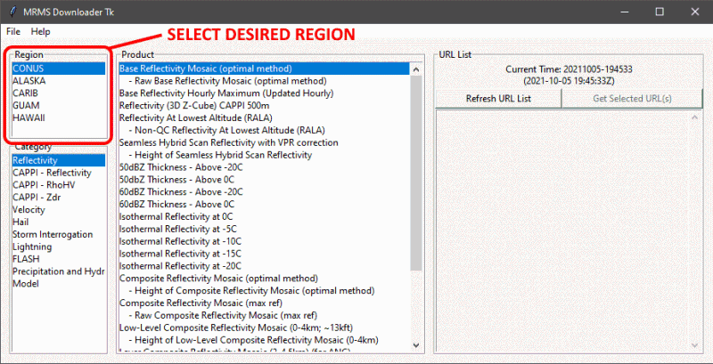

## MRMS Downloader Tk v1.01

MRMS Downloader Tk is a Python Tkinter Zipapp used for downloading (to have a local archive) MRMS (Multi-Radar Multi-Sensor Products (`.GRIB2`) and Level-II and Level-III radar products (`.tif`) found on the [MRMS Website](https://mrms.ncep.noaa.gov). The purpose is to streamline retrieval and archival of the data by enabling the rapid change between regions or radar types, categories or radar sites, and products, followed by listing the available files.

### Changes in this version (v1.01)
- Apparently there was an error in version 1 that prevented it from retrieving available urls. Well, the purpose of this release was to fix that.

### Contents
  - [Learning About Multi-Radar Multi-Sensor Products](#learning-about-multi-radar-multi-sensor-products)
  - [Requirements and Installation](#requirements-and-installation)
  - [Operation and Modes](#operation-and-modes)
  - [Viewing the Files](#viewing-the-files)
  - [Credits](#credits)
  - [Copyright / License](#copyrightlicense)

### Learning About Multi-Radar Multi-Sensor Products

The following links will be beneficial to those seeking to learn about MRMS. These same links are available within the program under the `Help` menu.

  - [MRMS Training Modules (by the Warning Decision Training Branch of the NWS)](https://training.weather.gov/wdtd/courses/MRMS/index.php)
  - [MRMS Products Guide (WDTB Virtual Lab)](https://vlab.noaa.gov/web/wdtd/mrms-products-guide)
  - [Operational MRMS GRIB2 Tables](https://www.nssl.noaa.gov/projects/mrms/operational/tables.php)

Quality information about the radar files can be found here: https://www.weather.gov/radarfaq

[&#8679; back to Contents](#contents)

### Requirements and Installation

Python version `>= 3.5` with `tkinter` installed should be sufficient. The `zipapp` package was not introduced until `v3.5`.

#### Installation Instructions

1. Download `mrms_downloader_tk.pyz` and place it into its own directory.
2. Run the file. That's it!

[&#8679; back to Contents](#contents)

### Operation and Modes

Product listings can be switched from MRMS to Radar (and vice-versa) via `Mode` in the File Menu.

#### MRMS

1. Choose a Region
    - CONUS = Contiguous United States (the 'lower 48')
2. Choose a Category
    - There are some regionally-based exceptions of available categories/products. For example:
	  - There are no velocity products for Alaska.
	  - Only CONUS has lightning products.
    - The categorization is arbitrary. Nor does it originate from any official MRMS directory structures. It's offered as a focal assistant (though subjective one) to the user.
3. Choose a Product
4. Click `Refresh URL List`
    - A large list of files will appear in the right-most frame. They will be in time-descending order (newest-to-oldest).
	- Products that have previously been downloaded will appear in green.
5. Select from the URL/File list the items of interest
    - To select multiple items, you can mouse-drag over files and/or hold `CTRL` or `SHIFT` as you make selections.
6. To download, click `Get Selected URL(s)`
    - Prior to downloading, the app checks for existence of the file. If it already exists, the command to download will be ignored and a message indicating this will appear in the console.
	  - The only exception to this is the `...latest.grib2.gz` file listed at the top of each refresh of the URL list. It always holds the newest data, keeping the same file name.
	- The files will be saved within the folder of operation, under a directory structure similar to that found from the source site.

- MRMS Files will be `GRIB2` formatted files (`.grib2.gz` extension.

#### Radar

First you must switch to Radar mode.

1. Click `File`, `Mode`, and `Radar`
2. The options will re-populate to allow selection of radar quality, site, and products.
3. Choose the radar quality (Level 2 or 3) and radar site (listed by state).
4. Follow steps 3 thru 6 of the MRMS operation steps

- Radar files will be saved under a folder of the radar-site's callsign. Then they'll be further discriminated by radar quality and radar product.
- Radar files are GeoTIFFs, of a `.tif.gz` extension.

[&#8679; back to Contents](#contents)

### Viewing the Files

You'll need some other software for visualization of the files. Below are just a few options; some will be more feasible depending on your aim.

- [NOAA's Weather Climate Toolkit (WCT)](https://www.ncdc.noaa.gov/wct)
- [Unidata Integrated Data Viewer (IDV)](https://www.unidata.ucar.edu/software/idv)
- [McIDAS-V](https://www.ssec.wisc.edu/mcidas/software)
- [QGIS](https://www.qgis.org)

[&#8679; back to Contents](#contents)

### Credits

- All links in the ["Learning About Multi-Radar Multi Sensor Products"](#learning-about-multi-radar-multi-sensor-products) section have been very nice resources to have while organizing the structure, layout, and offerings of the app.
- The data downloaded using this app is retrieved from:  https://mrms.ncep.noaa.gov/data/
- The clock updating scheme is not original to me; but I also can't remember the singular place I saw online, so I don't feel it would be accurate to credit a few places that I can't recall for sure.

[&#8679; back to Contents](#contents)

### Copyright/License

- &copy; 2021-2023, Kyle S. Gentry
- https://ksgwxfan.github.io
- MIT License

[&#8679; back to Contents](#contents)

